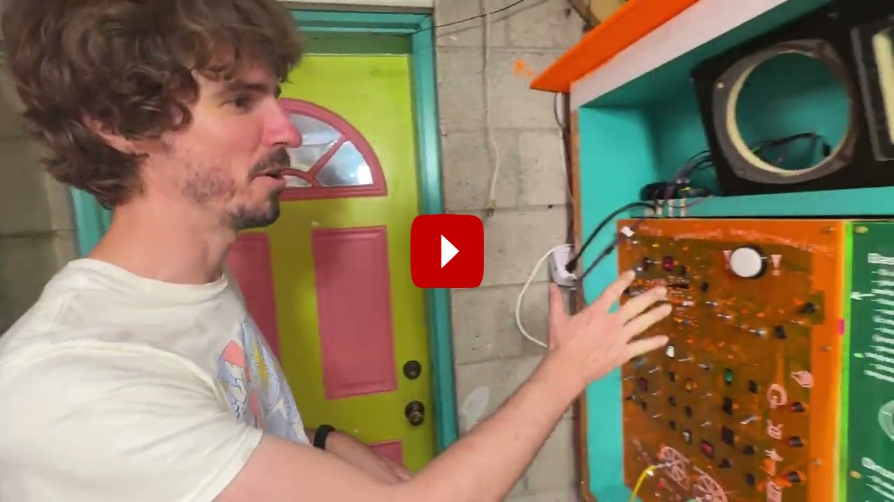

# The Wacky Waterwheel Wonder Machine!

A synthesizer, drum machine, electromechanical, waterwheel powered musical intsrument!

.jpg>)

Started in Oct. 2022 in Nashville, TN as part of The Paradise Driveway residency, full working version complete in Oct. 2025.

Project created in collaboration with

- [Neil Fridd (aka Terror Pigeon)](https://terrorpigeon.bandcamp.com/)
- [Jen Gavin (aka Paradise MIDI)](https://paradisemidi.com/)

# Overview

The Waterwheel Wondermachine is a nature powered mechanical-electronic logic idea workstation. It is a hybrid of bass synthesizer, drum machine, and kinetic motor instrument. When it rains, the waterwheel spins and every spoke of the wheel triggers the machine to advance one step of the sequence.

It has the feel of an old analog switch board or the cockpit of an airplane with 50+ toggle switches, patch cables, and LEDs scattered everywhere. Intimidating as it may look from the outside — and even more so on the inside since the front panels are translucent — the machine is simple enough where anyone can walk up and play it!

When it rains, the machine generates evolving musical sequences mixed with the percussive sounds of the external motors striking parts of the frame. When the sun returns, it transforms into a contemplative sound sculpture, droning notes played on the touch canvas panel.

You can play a melody on the waterwheel drawing, using its cleverly arranged key sequence to inspire a new variation on the original idea. All of this is contingent on the correct environmental conditions (rain), so that you have a consistent performance. The rain sounds also play a sonic role, incorporating into the spacial ambiance.

# Tech Specs

- 16 step bass synthesizer sequencer
- 8 step, 4 sample drum sequencer
- 2x motor outputs, motors mounted in the instrument area, creating sounds by clever mounting with the motors hitting parts of the frame.
- All timing and sequencing done with CD4xxx logic chips and digital circuity, a complex puzzle of logic chips, inputs and outputs and buffering.
- the note input of the synthesizer is a drawing of a waterwheel and tree house (homage to Neil s backyard). We cut these pieces out of metal and are using capacitive touch to send those notes to the synthesizer.
- 1 big sample button to trigger a sample whenever the performer wants

# PCB

## V1 - etched

- Schematic was designed in October 2022. A PCB (well 3 actually...) were designed and then etched on the driveway on copper clad FR4 board. Here is the design:
  
  
- The etched PCB was tested and then a full PCB was designed and fabricated by JLCPCB

## V2 - fabricated PCB

[Link to Schematic for V2](https://github.com/zumdar/waterwheel_drum-synth-machine/blob/main/PCB/pcb_files_v2%20-%20fabricated%20PCB/waterwhel_V2_SCHEMATIC.pdf)

## PCB V2 errors

- no pulldown for clock
- 555 footprint doesnt fit
- some silkscreen labels are covered up by connectors

# References

[getting trigger from sequencer - casper electronics ](https://web.archive.org/web/20130509102109/http://casperelectronics.com/2007/03/19/sequencer-update/)

[more info about multi channel 4017 sequencer/trigger - sailor mouth](https://web.archive.org/web/20160915053601/http://www.sailormouth.org/trigseq2.html)

[how to get a easy trigger with the 4017 sequecner - little gate seq - electro music forum](https://electro-music.com/forum/topic-63020.html)

[MFOS 4017 sequencer lots of good info on how it works](http://musicfromouterspace.com/analogsynth_new/TENSTEPSEQUENCER/TENSTEPSEQUENCER.php)

[classic baby 10 sequencer](https://hackaday.com/2016/01/14/oh-baby-baby10-build-a-classic-analog-music-sequencer/)
