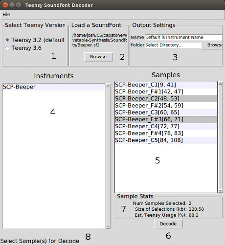
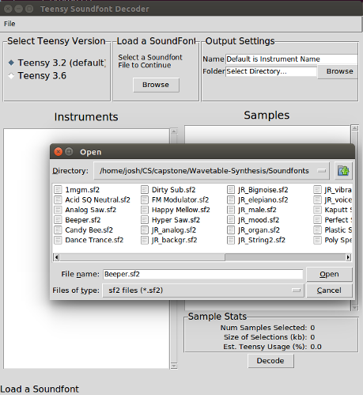
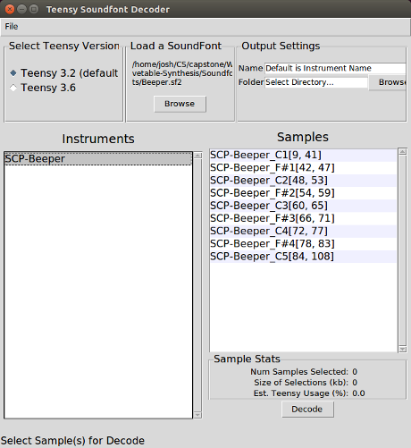
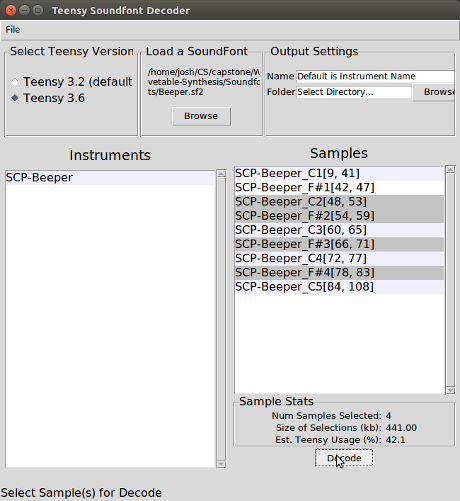
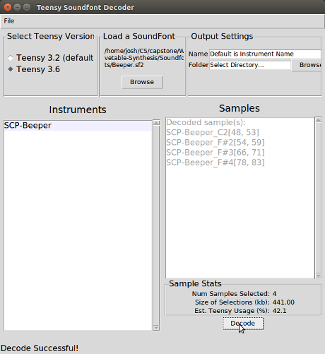

# SoundFont Decoder User-Guide

[TOC]

# 1-0 About {#about}

This document is a user guide for the SF2 decoder created for the Wavetable Synthesis Capstone project at Portland State, Fall 2016 - Winter 2017. The decoder described in this document is meant to take SF2 files and translate them into a format that can be used with the AudioSynthWavetable library for use on the Teensy 3.2 and 3.6.

More information about the AudioSynthWavetable library can be found at:
https://github.com/TeensyAudio/Wavetable-Synthesis

More information about the Teensy 3.2 and 3.6 can be found at:
https://www.pjrc.com/teensy/index.html

# 2-0 Required Software & Libraries {#required}

* Python 3.6 is required for the decoder to operate properly.

    Information about installing Python can be found at:
    https://www.python.org/downloads/release/python-360/

* The sf2utils library is also required for the decoder to operate.

     To install sf2utils you can use the following command:
   
         pip install sf2utils

     Further installation instructions and information about sf2utils can be found at:
     https://pypi.python.org/pypi/sf2utils

# 3-0 Using the Decoder with the GUI {#decoderGUI}
## 3-1 GUI Layout {#guiLayout}

The following section covers what each component of the GUI does.

1. Select Teensy Version: Select the current version of the Teensy that is being decoded for. The size selected will affect the Teensy % usage estimate given when selecting samples. The output files for both options is the same.

2. Load a SoundFont: Browse for a file with an `.sf2` extension to load into the decoder. Once a file is selected the file path will is displayed here as well.

3. Output Settings: Select a name and output location for the .cpp and .h files produced by the decoder. The default name is the instrument name. The default output location is the file the decoder was launched from.

4. Instrument Window: After a `.sf2` file is loaded into the decoder all the instruments contained in the file will be listed here. Clicking on an instrument in this window will bring up its samples in the samples window.

5. Samples Window: Displays all of samples for a given instrument. In this window multiple samples can be selected/deselected by holding `ctrl` and clicking on each one. A sample is selected when it’s highlighted
This window also displays a confirmation message and list of decoded samples when samples have been successfully decoded.

6. Decode Button: Once the desired samples have been selected in the samples window clicking this button will decode the samples.

7. Sample Stats: As samples are selected/deselected this window displays quantity, size and Teensy usage information. The Teensy usage % is only an estimate of the actual usage and results may vary.

8. Status Bar: The current status of the decoder is displayed here.

## 3-2 Decoding a Sample {#decodesampleGUI}

This section gives a basic walk through of loading a `.sf2` file, selecting a sample and decoding it with the GUI.
####Step 1: Click browse and select .sf2 file to load into decoder

#### Step 2: Select an Instrument to bring up its sample list

#### Step 3: Select samples to decode from instrument

Note: The selected samples are shown in grey. Also multiple samples can be selected if the `ctrl` button on the keyboard is held during sample selection.

#### Step 4: Click the decode button to decode samples

#### Step 5: Get confirmation message

Note: The confirmation message is displayed in the status bar. (bottom right)

At this point the decoded sample files (`.cpp` and `.h`) will be in the output directory and will be named after the selected instrument. By default this directory is the same that the decoder was launched from.

# 4-0 Using the Decoder from the Command Line {#decodercommandline}
## 4-1 Decoding a Sample {#decodesamplecl}

This section gives a basic walk through of starting the decoder, loading an `.sf2` file, selecting a sample and decoding it from the command line.

#### Step 1: Start the decoder & load `.sf2` file
The following shows how to start the decoder with a file `Example.sf2`
    
    python3 decoder.py -i Soundfonts/Example.sf2

#### Step 2: Select option to bring up instrument list for `.sf2` file

           WELCOME  
    
    1. Select by Instrument
    2. Quit
    
    Select [1-2]: 1

#### Step 3: Enter the number corresponding to the instrument to select samples from

    1. string
    2. bass
    3. tom
    4. mood
    
    Select Instrument [1-4]: 3

#### Step 4: Choose to select samples to decode.

    1. Export All Samples
    2. Select Samples to Export
    
    Select [1-2]: 2

Alternatively, the option to decode all samples could be chosen and a confirmation message would be displayed before exiting the decoder.

#### Step 5: Select samples to decode by entering their number.

    1. mood2
    2. mood3

    Select Sample [1-2]: 2

#### Step 6: Once samples have been selected choose more or save and exit.

    1. Select Again
    2. Save and Quit
    
    Select [1-2]: 2
    Selected samples for instrument decoded successfully. Exiting Program.

Following step 6 the decoded sample files (`.cpp` and `.h`) will be in the output directory and will be named after the selected instrument. By default this directory is the same that the decoder was launched from.

## 4-2 Command Line Options {#CLoptions}

There are 2 options available when running the decoder from the command line.
`-i` is the input flag. This option is mandatory for proper operation of the decoder and must precede the name of the `.sf2` input file.
`-d` is the debug flag. This should only be used when making changes to the decoder and debug info is needed.

# 5-0 Decoder Output {#decoderoutput}
This sections gives a brief overview of what is found in the output files created by the decoder.

## 5-1 .cpp file {#cppfile}
This file contains a `sample_data` structure that contains metadata for each sample that was extracted from the `.sf2` file. Following the `sample_data` structure is all of the sample arrays holding the audio data. The samples in this file are organized by key range values in ascending order.

## 5-2 .h file {#hfile}
This file contains `extern` declarations for all of the sample arrays in the `.cpp` file as well as a declaration for the structure that holds the metadata.

This is the file that will be included using a `#include` statement in an Arduino sketch file so that the samples are available.
